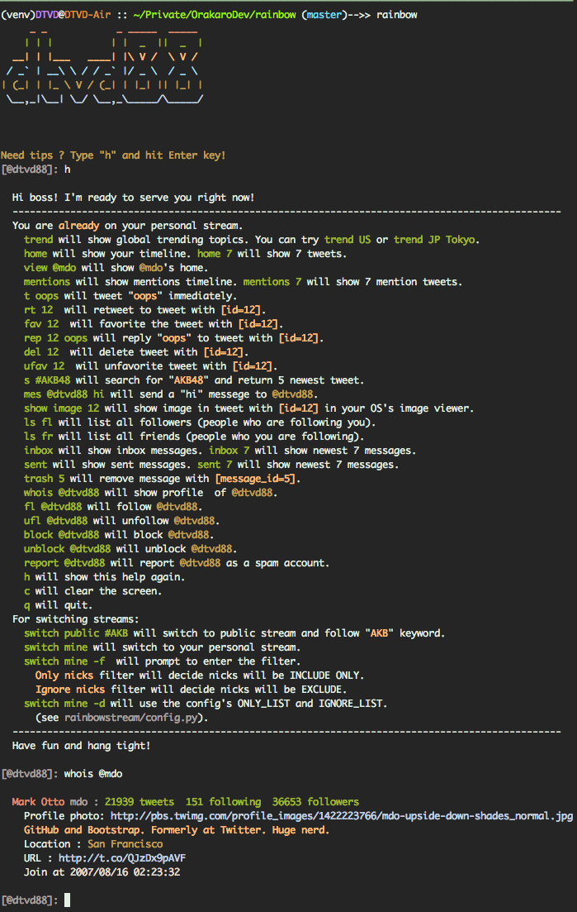
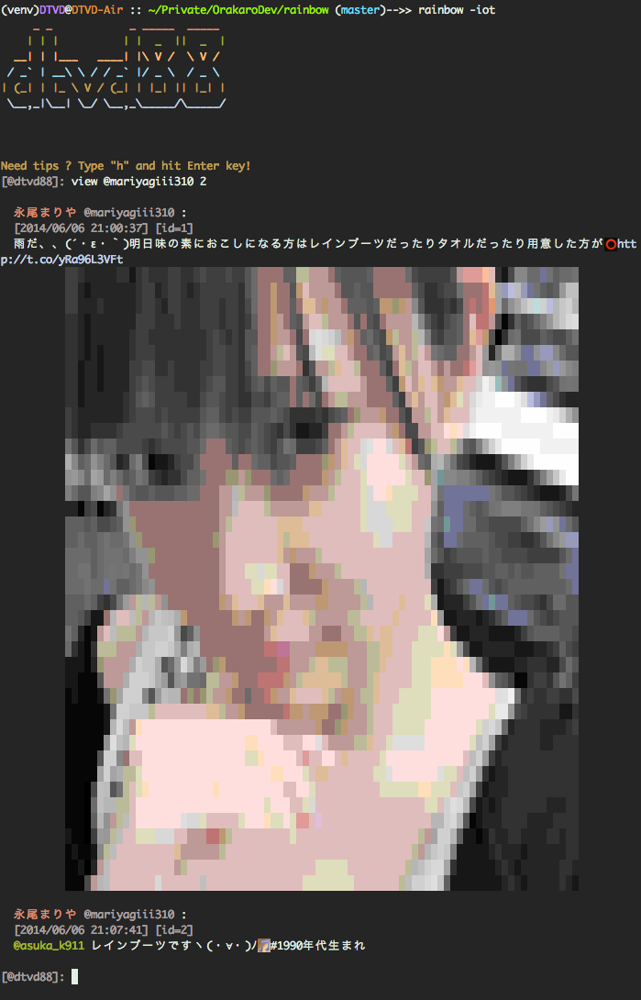

Rainbow Stream
--------------

|Download| |Version|

Terminal-based Twitter Client. Realtime tweetstream, compose, search ,
favorite … and much more fun directly from terminal.

This package is built on top of `Python Twitter Tool`_ and `Twitter API`_.

Screenshot
----------

|rainbowstream| |rainbowstreamIOT|

Install
-------

You will need Python 2.7+ and pip.

.. code:: bash

    pip install rainbowstream

Usage
-----

The stream
^^^^^^^^^^

Just type

.. code:: bash

    rainbow

and see your stream.

I shipped a feature which can display **tweet’s images directly on
terminal**. You can try it with:

.. code:: bash

    rainbow -iot # Or rainbow --image-on-term

In the first time you will be asked for authorization of Rainbow Stream
app at Twitter. Just click the “Authorize access” button and paste PIN
number to the terminal, the rainbow will start

The interactive mode
^^^^^^^^^^^^^^^^^^^^

While your personal stream is continued, you are also ready to tweet,
search, reply, retweet… directly from console. Simply type “h” and hit
the Enter key to see the help.

Input is in interactive mode. It means that you can use arrow key to
move up and down history, tab-autocomplete or 2 tab to view available
suggestion. Input history from previous run is available as well.

Here is full list of supported command

**Action Commands**

-  ``trend`` will show global trending topics. ``trend US`` will show
   trends in United States while ``trend JP Tokyo`` will show trends in
   Tokyo/Japan.

-  ``home`` will show your timeline. ``home 10`` will print exactly 10
   tweets.

-  ``view @mdo`` will show @mdo ’s timeline. ``view @dmo 9`` will print
   exactly 9 tweets.

-  ``mentions`` will show mentions timeline. ``mentions 7`` will show 7
   mention tweets.

-  ``t the rainbow is god's promise to noah`` will tweet exactly *‘the
   rainbow is god’s promise to noah’*.

-  ``rt 12`` will retweet the tweet with *[id=12]*. You can see id of
   each tweet beside the time.

-  ``fav 12`` will favorite the tweet with *[id=12]*.

-  ``rep 12 Really`` will reply *‘Really’* to the tweet with *[id=12]*.

-  ``del 12`` will delete tweet with *[id=12]*.

-  ``ufav 12`` will unfavorite tweet with *[id=12]*.

-  ``s #noah`` will search the word *‘noah’*. Result will come back with
   highlight.

-  ``mes @dtvd88 hi`` will send a ``hi`` message to @dtvd88.

-  ``show image 12`` will show the image in tweet with *[id=12]* in your
   OS’s image viewer.

-  ``ls fl`` will list all your followers (people who are following
   you).

-  ``ls fr`` will list all your friends (people who you are following).

-  ``inbox`` will show inbox messages. ``inbox 7`` will show newest 7
   messages.

-  ``sent`` will show sent messages. ``sent 7`` will show newest 7
   messages.

-  ``trash 5`` will remove message with *[message\_id=5]*

-  ``whois @dtvd88`` will show profile of @dtvd88.

-  ``fl @dtvd88`` will follow @dtvd88.

-  ``ufl @dtvd88`` will unfollow @dtvd88.

-  ``h`` will show the help.

-  ``c`` will clear the screen.

-  ``q`` will quit.

**Stream Commands**

-  ``switch public #AKB48`` will switch current stream to public stream
   and track keyword ``AKB48``

-  ``switch public #AKB48 -f`` will do exactly as above but will ask you
   to provide 2 list:

   ``Only nicks`` decide what nicks will be include only.

   ``Ignore nicks``\ decide what nicks will be exclude.

-  ``switch public #AKB48 -d`` will apply filter to *ONLY\_LIST* and
   *IGNORE\_LIST*. You can setup 2 list above at ``config.py``

-  ``switch mine`` will switch current stream to personal stream. ``-f``
   and ``-d`` will work as well.

For example see the screenshot above.

Bug Report
----------

Please `create an issue`_ or contact me at
[@dtvd88](https://twitter.com/dtvd88)

License
-------

Rainbow Stream are released under an MIT License. See LICENSE.txt for
details

.. _Python Twitter Tool: http://mike.verdone.ca/twitter/
.. _Twitter API: https://dev.twitter.com/docs/api/1.1
.. _create an issue: https://github.com/DTVD/rainbowstream/issues/new

.. |Download| image:: http://img.shields.io/pypi/dm/rainbowstream.svg?style=flat
   :target: https://pypi.python.org/pypi/rainbowstream
.. |Version| image:: http://img.shields.io/pypi/v/rainbowstream.svg?style=flat
   :target: https://pypi.python.org/pypi/rainbowstream

